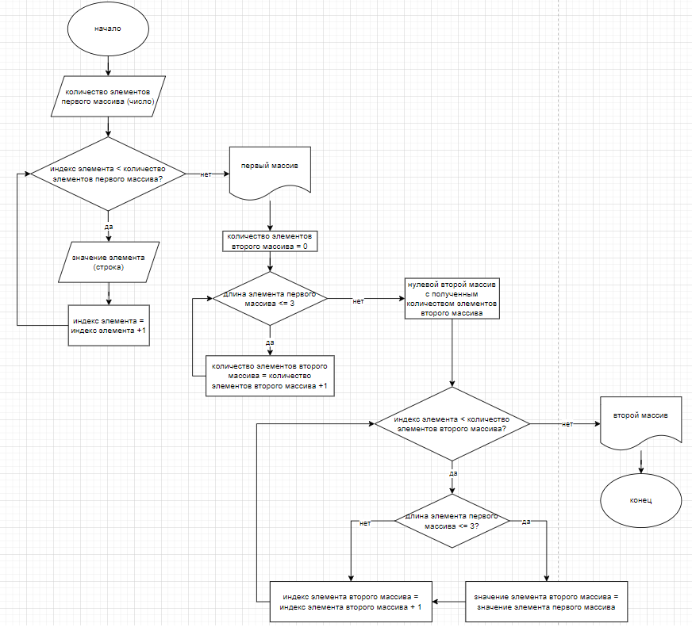

# Описание выполнения итоговой контрольной работы по основному блоку 

## Создание репозитория на GitHub

1. В разделе **Repositories**, при помощи выделенной зелёным цветом кнопки **New** переходим на страницу создания нового репозитория;

2. Задаём желаемое имя репозитория, к примеру: *MainBlockControlWork* и кликаем кнопку **Create repository**.

3. Репозиторий создан, осталось прописать его связь с директорией на локальном компьютере, для этого:

* В VSCode создадим папку проекта контрольной работы;

* Инициируем контроль версий командой _**git init**_ 

* Создадим сохранение первой версии командой _**git add .**_  и первый коммит командой _**git commit -m " "**_, где в ковычках пропишем коммит, к примеру *"initial commit"*

* Сменим название ветки **master** на **main** введением команды, скопированной со страницы созданного репозитория на GitHub: _**git branch -M main**_

* Пропишем связь между директорией на локальном компьютере и репозиторием GitHub введением команды, скопированной со страницы созданного репозитория на GitHub: _**git remote add origin https://github.com/DKchel/MainBlockControlWork.git**_

4. Скопируем все данные в созданный репозиторий на GitHub введением команды: _**git push -u origin main**_

5. В дальнейшем, для копирования данных на GitHub пользуемся командой _**git push**_

## Gitignore

Чтобы не засорять репозиторий лишними файлами, добавим файл Gitignore с данными из лекции.

## Алгоритм 

